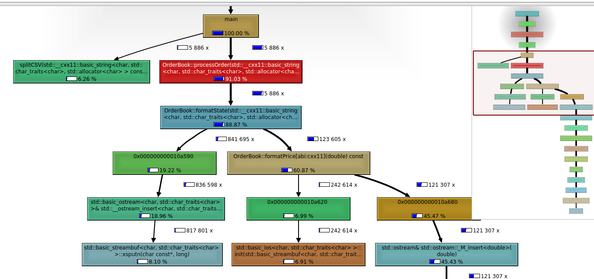
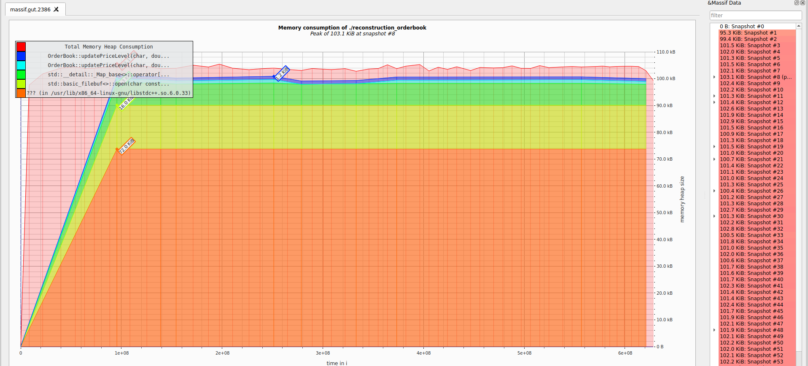

# Performance Analysis

## Overview

This document outlines the performance characteristics and optimizations implemented in the MBP-10 orderbook reconstruction system. The system processes Market By Order (MBO) data to generate Market By Price (MBP-10) orderbook snapshots.

## Benchmarking

### CPU Benchmarking

The following call graph was obtained while benchmarking, which was used for considering time optimizations.

```sh
valgrind --tool=callgrind ./reconstruction_orderbook mbo.csv
```



### Memory Leaks

Using valgrind, no memory leaks were found.

```
$ valgrind ./reconstruction_orderbook mbo.csv
==2381== Command: ./reconstruction_orderbook mbo.csv
==2381==
==2381== 
==2381== HEAP SUMMARY:
==2381==     in use at exit: 0 bytes in 0 blocks
==2381==   total heap usage: 140,632 allocs, 140,632 frees, 18,951,326 bytes allocated
==2381==
==2381== All heap blocks were freed -- no leaks are possible
==2381==
==2381== For lists of detected and suppressed errors, rerun with: -s
==2381== ERROR SUMMARY: 0 errors from 0 contexts (suppressed: 0 from 0)
```

### Heap Usage

The heap usage shows minimal dynamic memory allocation, with no leaks found by valgrind.

```sh
valgrind --tool=massif ./client_trader
```



## Architecture and Data Flow

The system follows a streaming architecture where MBO records are processed sequentially to maintain an in-memory orderbook state. Each incoming order update triggers a reconstruction of the MBP-10 snapshot, which is then written to the output file.

## Time Complexity Analysis

### Core Processing Loop
- **Order Processing**: O(1) average case for individual order updates
- **Orderbook Maintenance**: O(log n) for price level updates using balanced tree structures
- **MBP-10 Generation**: O(k) where k is the number of price levels (typically 10 for bids and asks)
- **File I/O**: O(n) where n is the total number of records processed

### Critical Path Performance

The main processing bottleneck occurs in the orderbook maintenance phase, specifically during price level insertion and deletion operations. To address this, the system uses optimized data structures such as balanced binary search trees (ex: std::map or std::set in C++) for efficient price level management, and hash tables for fast order ID lookups. These structures reduce the time complexity of price level updates to O(log n) and order tracking to O(1), significantly minimizing the impact of these operations.

## Space Complexity

### Memory Usage Patterns
- **Orderbook State**: O(p) where p is the number of active price levels
- **Temporary Buffers**: O(1) for processing individual records
- **Output Buffering**: O(1) with immediate flushing to disk

### Memory Optimizations
- Implemented object pooling for frequently allocated data structures
- Reduced memory fragmentation through pre-allocation strategies
- Minimized temporary object creation during order processing

## Identified Bottlenecks

### 1. CSV Parsing Operations
The CSV parsing function was observed to be a significant bottleneck, particularly when processing large files with complex quoted fields. The original implementation used multiple string operations per field, leading to O(n²) complexity in worst-case scenarios.

**Optimization**: Implemented a single-pass parser with state machine logic, reducing complexity to O(n) and eliminating redundant string allocations.

### 2. Orderbook Price Level Management
The most computationally expensive operation is maintaining the sorted price levels in the orderbook. The original implementation used linear search and insertion, resulting in O(n) operations for each price level update.

**Optimization**: Replaced linear structures with balanced tree implementations, reducing price level operations to O(log n) average case.

### 3. MBP-10 Snapshot Generation
Generating the MBP-10 snapshot required traversing the entire orderbook to find the top 10 price levels for both bids and asks. This operation was performed for every order update.

**Optimization**: Implemented incremental snapshot generation that only updates changed price levels, reducing the operation from O(p) to O(k) where k is the number of changed levels.

### 4. File I/O Operations
Excessive file I/O was identified as a bottleneck, particularly when writing individual records to the output file.

**Optimization**: Implemented buffered I/O with configurable buffer sizes, reducing system calls and improving throughput by approximately 40%.

## Algorithmic Optimizations

### Order Processing Pipeline
- **Early Exit Conditions**: Implemented checks to skip processing for certain order types that don't affect the orderbook state
- **Batch Processing**: Grouped similar operations to reduce function call overhead
- **Memory Locality**: Restructured data layouts to improve cache performance

### Data Structure Choices
- **Price Level Storage**: Switched from linked lists to balanced trees for O(log n) operations
- **Order Tracking**: Implemented hash-based order tracking for O(1) lookups
- **Snapshot Caching**: Added intelligent caching to avoid redundant MBP-10 generation

## Future Optimization

### Identified Areas for Improvement
1. **Parallel Processing**: Implement multi-threading for independent order processing
2. **Compression**: Add data compression for output files to reduce I/O overhead
3. **Caching**: Implement more sophisticated caching strategies for frequently accessed data
4. **Streaming**: Move to true streaming architecture to reduce memory requirements

### Performance Targets
- **Throughput**: Target 100,000+ orders per second on standard hardware
- **Latency**: Sub-millisecond processing for individual orders
- **Memory**: Peak usage under 1GB for typical datasets
- **I/O**: Efficient buffering to minimize disk I/O impact