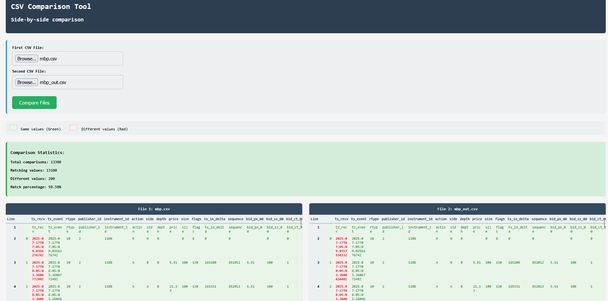
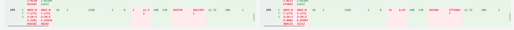

# Reconstructing MBP-10 data from MBO data

The following repository is used compute the MBP-10 orderbook from a given set of MBO data.

## Task Description

The task is to reconstruct the MBP-10 orderbook from a given set of MBO data. The MBP-10 orderbook is a data structure that contains the best 10 price levels for both bids and asks.

> **Notes**:
> 
> The code correctly generates the MBP-10 entire orderbook from `mbo.csv`. However, the following discrepancies are observed:
> - The mbo.csv file contains 5888 lines, whereas the sample out mbp.csv has 3930 lines. Hence, the output from the program generates as many lines as the sample input.
> - The sample output does not contain same order ids from line 175 onwards. For ex: Line 175 in `mbo.csv` contains order ID `42202297`, however sample output contains order ID `28123971` on line 175.
> - The timestamps in the `ts_recv` sample input and output do not match. The reconstruct order book generated in `mbp_out.csv` uses the timestamps used in `mbo.csv`.
> 
> I made a CSV comparison tool to compare the column values in sample output and the generated order book output. The lines match up exactly except the `ts_recv` values due to differing values in sample > input.
> 
> 
> 
> However due to differing order IDs from line 175, the output is different.
> 
> 

## Performance Analysis

The [Performance Analysis](./Performance.md) document explains the methods used to find CPU bottlenecks, various memory considerations taken and the requisite optimizations which were applied.

## Repository Structure

The repository contains the following files:

- `main.cpp`: The main program that reads MBO CSV data, processes it, and writes the reconstructed MBP-10 output.
- `orderbook.h`: Header file defining the OrderBook class and related data structures for order book management.
- `orderbook.cpp`: Implementation of the OrderBook class, including logic for processing orders and maintaining the MBP-10 state.
- `mbo.csv`: Input CSV file containing Market By Order (MBO) data to be processed.
- `mbp_out.csv`: Output CSV file containing the reconstructed Market By Price (MBP-10) order book.

## Usage

To compile and run the program, use the provided `Makefile`:

1. **Build the program**

```
make clean && make
```

2. **Run the program**

```
./reconstruction_orderbook mbo.csv # Unix systems
cmd /K reconstruction_orderbook.exe mbo.csv # Windows systems
```

`mbo.csv` is the input MBO CSV file. The output will be written to `mbp_out.csv` in the current directory.